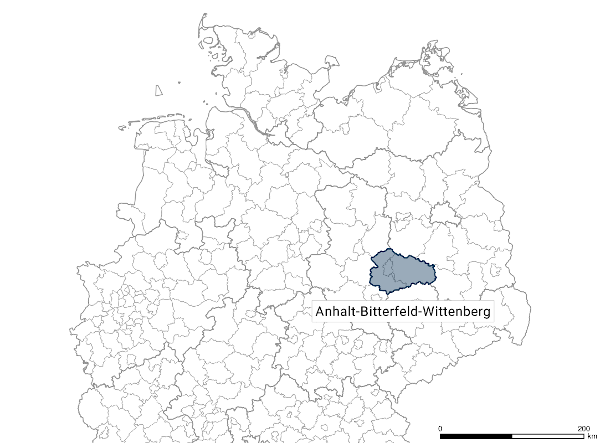
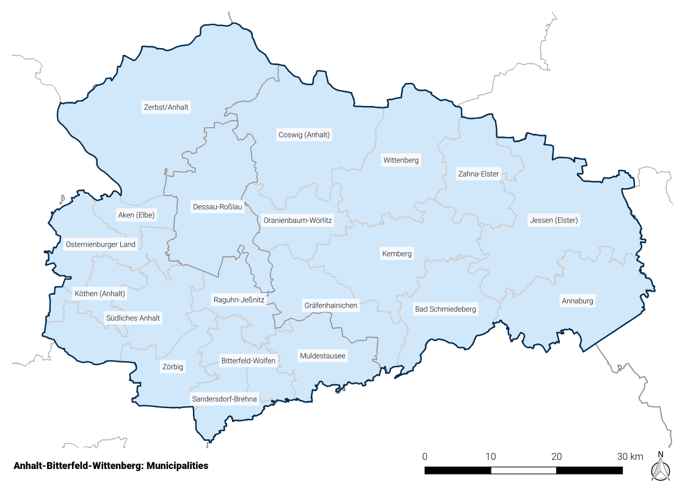
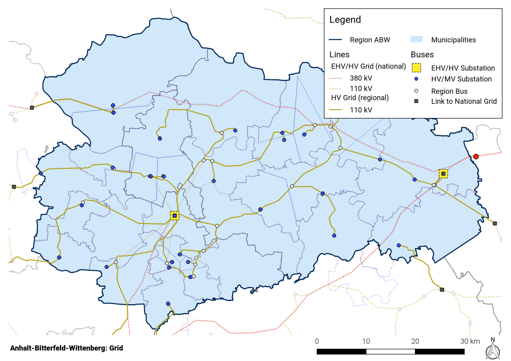
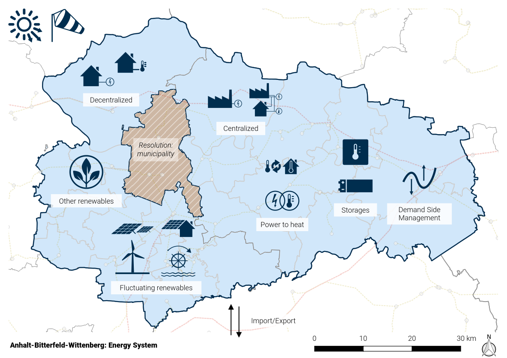
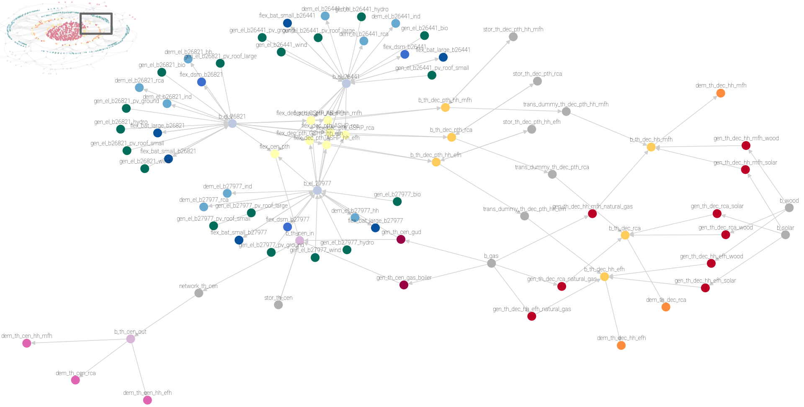

.. _esm:

Energy system model
===================

The region Anhalt-Bitterfeld-Wittenberg (ABW)
---------------------------------------------

The Anhalt-Bitterfeld-Wittenberg (ABW) region modelled in this tool is located in the east of Saxony-Anhalt comprising
the three districts Anhalt-Bitterfeld, Wittenberg, and the city of Dessau-Roßlau (:numref:`map_de_abw`). It has a total
area of 3,629 km² and a population of 370,190 inhabitants in 2017.

.. _map_de_abw:

   Region ABW in Germany

.. _map_abw_esys1:

   Region ABW with municipalities

Substantial amounts of RES are installed in the region. In 2017, 717 MW of wind power and 445 MW of ground-mounted
PV covered 63 % of the regional electricty demand of 20 municipalities.

..
  COMMENTED OUT
 .. image:: images/map_de_abw.png
    :width: 50 %
 .. image:: images/map_abw_esys1.png
    :width: 40 %

Rationale and model focus
-------------------------

The employed energy system model (ESM) is based on the energy system modeling framework *oemof-solph* :cite:`Krien2020`.
The model comprises the electricity and heat sector of ABW at municipal-level at a temporal resolution of 1 hour.
It is formulated as a linear optimization problem with the objective of minimizing the cost for operation, CO2 emission
allowances and grid extension.

Grid model
----------

The transmission capacities between the municipalities are given by the extra high voltage (380 kV) and high voltage
grid (110 kV) as shown in :numref:`map_abw_grid`; its topology and parameters were taken from :cite:`Mueller2018`,
:cite:`openego2019`. This allows for a realistic assessment of the intra-regional exchange and grid load as well as the
identification of potential congestions on those voltage levels.

Subsequently, the electrical generation and demand of the municipalities are allocated to high voltage (HV) / medium
voltage (MV) transformer stations. The allocation is done as follows:

* Municipality contains no HV/MS station: electric components are connected to the closest station available
* Municipality contains 1 HV/MS station: electric components are connected to this station
* Municipality contains >1 HV/MS stations: all electric components are evenly distributed to stations

Although the national grid is not explicitly modeled, it is used for power exchange by municipalities without direct
connection to the regional grid. Imports and exports are facilitated by using virtual sources and sinks located at 9
cross-regional links to the national grid.

.. _map_abw_grid:

   Extra high voltage and high voltage grid of ABW with cross-regional links to the national grid

Medium and low voltage distribution grids are not part of the grid model. District heating networks are not explicitly
modelled but the heat demand of connected consumers is taken into account.

.. _esm_generation_demand_label:

Generation and demand
---------------------

On the electrical generation side, wind turbines, ground-mounted PV, roof-mounted PV, biogas plants, run-of-river
plants, combined-cycle gas turbines (CCGT), and simple-cycle gas turbines (SCGT) have been integrated as the most
important technologies in the region. The heat generation includes decentralized conventional heating systems primarily
based on natural gas, wood, and fuel oil. Four large district heating networks are located in the region which are fed
by CCGT, large CHP units, and gas-fired boilers. Small networks are not part of the model. The electrical and heat
demand incorporates the residential, commercial, trade, services (CTS) and agricultural sector; for the industrial
sector, only the electricity side is included. On the flexiblity side, the model integrates households with demand-side
management, battery storages, and power-to-heat (heat pumps and electrical boilers). :numref:`map_abw_esys6` shows the
model's components.

.. _map_abw_esys6:

   Components of regional energy system model

.. _esm_fluctuating_renewables_label:

Fluctuating renewables
^^^^^^^^^^^^^^^^^^^^^^

The model includes georeferenced data on wind turbines, ground-mounted PV, roof-mounted PV, biogas plants, and
run-of-river plant data of 2017 from the *OPSD* project :cite:`OPSDre2018`.

Wind turbines
"""""""""""""

* Installed nominal power (2017): 717 MW
* Wind turbine models for the status quo (2017) are chosen according to the largest manufacturers in Germany in terms of
  market share :cite:`FraunhoferIEE2015`. Typical turbines of the two market leaders Enercon (40 %) and Vestas (24 %)
  that have been used are E-82 (85 m and 98 m hub height), E-115 (122 m hub height), V90 (80 m and 100 m hub height),
  and  V112 (119 m hub height). The individual turbine types were sorted into 2 classes <2.5 MW (87 %) and >2.5 MW
  (13 %) based on the installed types as of today (cf. above). The 6 types were weighted by market share.
* For both future scenarios, a single turbine model (Enercon E-141, hub height of 159 m)
* Feedin timeseries are generated by *reegis* :cite:`Krien2019` which uses *Coastdat-2* weather data
  :cite:`Coastdat2014` (weather year 2013).
* To account for annual variations, the data is scaled to match the mean annual full load hours in Saxony-Anhalt for
  2011-2015 of 1630 h given by :cite:`SAWindenergie2015`.

Photovoltaics
"""""""""""""

* Installed nominal power of ground-mounted systems (2017): 445 MW
* In the *OPSD* dataset :cite:`OPSDre2018` there's no information of the type of PV system (roof or ground-mounted).
  Based upon typical values :cite:`dena2012` plants with a nominal power of <=300 kWp area treated as rooftop systems,
  larger plants as ground-mounted systems.
* Feedin timeseries are generated by *renewables.ninja* :cite:`Pfenninger2016` which uses generic PV models and
  *CM-SAF SARAH* irradiation data :cite:`cmsaf2015` (weather year 2015).
* To account for annual variations, the data is scaled to match the mean annual full load hours in Saxony-Anhalt for
  2011-2015 of 998 h given by :cite:`SApv2015`.

Biomass and biogas plants
"""""""""""""""""""""""""

* In the absence of sufficient information on which plants are used for heat generation, it is assumed that all biomass
  and biogas plants are used exclusively for electricity generation.
* A constant feedin is assumed with 6000 annual full load hours :cite:`ISE2018`, :cite:`SABioenergie2015`.

Run-of-river plants
"""""""""""""""""""

* A constant feedin is assumed with 3833 annual full load hours (2012-2017 mean from :cite:`STALA2018`)

Conventional power plants
^^^^^^^^^^^^^^^^^^^^^^^^^

There are a couple of fossil-fueled CHP power plants which are included in the model; data from *OPSD* project
:cite:`OPSDconv2018` is used. Those plants feed into district heating systems as described in
:ref:`esm_district_heating_label`.

Electricity and heat demand
^^^^^^^^^^^^^^^^^^^^^^^^^^^

Energy demand today
"""""""""""""""""""

The annual electricity demand for each sector (residential, commercial, trade, services, agricultural and industrial)
and municipality is taken from :cite:`OEP2018` and allocated to the HV/MV stations. The hourly profiles are calculated
in different ways:

* Households: data from :cite:`gaehrs2020`
* Commercial, trade, services (CTS) and agricultural: standard load profiles (SLP G0) using the *demandlib*
  :cite:`demandlib2019`
* Industrial sector: band-like profile using the *demandlib* :cite:`demandlib2019`

The annual heat demand for space heating and hot water for each sector and municipality is determined as follows:

* Households: based on the number of buildings and living spaces from :cite:`StatistischesBundesamt2018` and
  :cite:`Zensus2017`, heat demands are calculated per municipality using building-specific consumptions from
  :cite:`IWU2015` and :cite:`BDEW2019`. The year of construction, unoccupancy rates and type of building (single or
  multi-family house) are taken into account. Time series are created with the *demandlib* :cite:`demandlib2019` using
  standard gas load profiles *HEF* and *HMF*. Furthermore, historical ambient temperature profiles from the closest DWD
  survey station :cite:`DWD2020` are incorporated.
* Commercial, trade, services (CTS) and agricultural: for these sectors, only the energy required for space heating and
  drinking water (no process heat) is taken into account. The definition of economic brnaches conform to the
  classification WZ2008 by the German Federal Statistical Office :cite:`StatistischesBundesamt2007` is used. For each
  branch, specific consumption values (mostly per employee, data from :cite:`StatistischeAemter2018`) are used from
  :cite:`BMWi2015` to calculate annual demands per municipality. As for households, time series are created with the
  *demandlib* :cite:`demandlib2019` but based upon the standard gas load profile *GHD* for CTS.

The results for electricity and heat demand for the status quo are shown below:

.. include:: electricty_heat_demand.rst

Energy demand in future scenarios
"""""""""""""""""""""""""""""""""

In 2035 and 2050, a reduction of electricity and heat demand is assumed due to building renovation and demographic
change. Other aspects such as changes in devices' efficiencies or consumers' behavior is not taken into account.

1. For the **heat demand**, an annual renovation rate is used to determine the total renovation quantity for the target
   years:

   * residential buildings: 1.0 % for 2017-2024, 1.6 % for 2025-2034, 2.0 % for 2035-2044, and
     2.5 % for 2045-2050 :cite:`BMWi2017`. This results in a total renovation rate of 24 % in 2035 and 56.2 % in 2050.
   * non-residential buildings: 1.3 % for 2017-2024, 2.15 % for 2025-2034, 2.7 % for 2035-2044, and 3.4 % for
     2045-2050. This results in a total renovation rate of 31.9 % in 2035 and 75.9 % in 2050.

2. The reduction of **heat demand** in renovated buildings is based upon the following renovation scenarios. The average
   of all three scenarios per sector is used as reduction rate in the model:

   * conventional ("konventionell" :cite:`IWU2015`): single- and multi-family households -33 %, CTS -33 %
   * fully renovated ("vollsaniert" :cite:`UBA2017`): single-family households -52 %, multi-family households -56 %,
     CTS -44 %
   * fully renovated+ ("vollsaniert+" :cite:`UBA2017`): single-family households -69 %, multi-family households -68 %,
     CTS -60 %

3. Moreover, a decrease in **electricity and heat demand** due to depopulation and decline in employment is taken into
   account.

   * 2035: population 307,877 (-16.8 %), employees 73,535 (-10.6 %)
   * 2050: population 275,411 (-25.6 %), employees 65,588 (-20.2 %)

4. The **electricity demand** of the CTS sector results from the specific consumption per employee from
   :cite:`BMWi2017`.

5. The reduction rate for industrial **electricity demand** is derived from the reference studies of the
   :ref:`scenarios` (:cite:`NEP2021`, :cite:`ISE2020`) and amount to -23 % in 2035 and -20 % in 2050 :cite:`ISE2020`.

Using these considerations the final energy reductions are as follows:

Electricity

* 2035: households -17 %, CTS -23 %, industry -23 %
* 2050: households -26 %, CTS -20 %, industry -20 %

Heat

* 2035: households -13 %, CTS -14 %, (industrial heat is not part of the model)
* 2050: households -31 %, CTS -33 %, (industrial heat is not part of the model)

.. _esm_heating_systems_label:

Centralized and decentralized heat systems
""""""""""""""""""""""""""""""""""""""""""

The total heat demand described above is split into centralized (district heating) and decentralized systems.
The four largest district heating networks are located in Dessau-Roßlau, Bitterfeld-Wolfen, Köthen and Wittenberg. The
municipal energy suppliers provided load profiles for different years :cite:`StadtwerkeABW2013` which were
temperature-corrected to profiles valid for 2017. This results in the following district heating shares: Dessau-Roßlau
42 %, Bitterfeld-Wolfen 15 %, Köthen 9 % and Wittenberg 20 %. Subsequently, the remaining heat demand is allocated to
decentralized consumers.

.. _esm_district_heating_label:

District heating
^^^^^^^^^^^^^^^^

System configuration in the four district heating networks:

Dessau-Roßlau
  * Combined-cycle gas turbines (CCGT) with 60 MW(th) und 59 MW(el) :cite:`Dunker2014`, :cite:`Brachert2019`
  * Gas-fired boilers
  * Heat storage 600 MWh

Bitterfeld-Wolfen, Köthen, Wittenberg
  * Combined heat and power (CHP) plants
  * Gas-fired boilers

As there's no further information on the feeding plants available, the following method is used to estimate the plant
configuration:

Dessau-Roßlau
  * CCGT (dispatchable) to cover the base load with a min. share of 80 % in heat demand :cite:`Konstantin2018`,
    :cite:`AGFW2004`. This constraint is needed as subsidies for power and heat cogeneration are not included in the
    revenues generated by this plant. Therefore the dispatch would be disencouraged resulting in a smaller annual energy
    output.
    (*oemof* component: `ExtractionTurbineCHP <https://oemof-solph.readthedocs.io/en/latest/usage.html#extractionturbinechp-component>`_)
  * Gas-fired boilers (dispatchable) cover the peak loads.
    (*oemof* component: `Transformer <https://oemof-solph.readthedocs.io/en/latest/usage.html#transformer-basic>`_)

Bitterfeld-Wolfen, Köthen, Wittenberg
  * CHP plants cover (dispatchable) the base load. Analyzing the annual load duration curves of the grids
    :cite:`StadtwerkeABW2013` shows that an installed power of 17 % of the peak load is reasonable tradeoff between
    installed power and utilization of a unit. With this assumption, more than 40 % of the annual demand can be met.
    (*oemof* component: `Transformer <https://oemof-solph.readthedocs.io/en/latest/usage.html#transformer-basic>`_)
  * Gas-fired boilers (dispatchable) cover the peak loads
    (*oemof* component: `Transformer <https://oemof-solph.readthedocs.io/en/latest/usage.html#transformer-basic>`_)

*Notes*
  * The electric energy produced by all feeding power units is fed into the closest MV/MV station.

.. _esm_dec_heating_systems_label:

Decentralized Heating systems
^^^^^^^^^^^^^^^^^^^^^^^^^^^^^

The technology shares in the decentralized heating systems for households in the status quo scenario are obtained from
*demandRegio* :cite:`FFE2019` on a district resolution. For the CTS and agricultural sector, data on federal state
resolution from :cite:`STALA2018` is used. It is assumed that these shares also apply for the underlying municipalities.
Per municipality, for each technology (natural gas, fuel oil, wood, coal, solar thermal, night storage heating,
ambient_heat) one generator (*oemof* components: `Source <https://oemof-solph.readthedocs.io/en/latest/usage.html#source-basic>`_
and `Transformer <https://oemof-solph.readthedocs.io/en/latest/usage.html#transformer-basic>`_) is created, feeding into
the decentral heat bus (see :ref:`esm_model_details_label`). Except for ambient_heat, which is provided by heat pumps in
the model and a flexible generation, all of the above sources are fixed generators whose feedin follow the heat demand
with its respective share. Energy generation of solar thermal systems is calculated using the normalized PV feedin
timeseries.

For the future scenarios based upon NEP (2035) :cite:`NEP2021` and ISE (2050) :cite:`ISE2020`, :cite:`ISE2021` (cf.
:ref:`scenarios`) different shares apply. The following table shows the configuration for all 3 scenarios/years per
district:

.. include:: heating_structure.rst

Methane
^^^^^^^

In the future scenarios, some components still rely on natural gas such as CCGT and boilers. Aligned to the two
underlying studies NEP (2035) :cite:`NEP2021` and ISE (2050) :cite:`ISE2020`, a fixed proportion of methane in the gas
network is assumed (2035: 0 %, 2050: 100 %) affecting the emissions and operational cost of those components.

Further notes
^^^^^^^^^^^^^

* Energy generation of small (in-house) CHP units is neglected.
* CCGT Bitterfeld: 110 MW(th), 110 MW(el) :cite:`Urbansky2019`. Electricity is fed into the HV grid. Heat is consumed by
  industrial sites only and therefore neglected (out of the model's boundary, cf. section
  :ref:`esm_generation_demand_label`).

Flexibility options
-------------------

As described earlier, the model integrates households with demand-side management, large-scale battery storages, and
power-to-heat (heat pumps and electrical boilers) in decentralized heating systems and district heating networks. This
section describes the underlying methods in detail, the resulting scenario parameters are listed in (cf.
:ref:`scenarios`).

Demand-side management (DSM)
^^^^^^^^^^^^^^^^^^^^^^^^^^^^

A DSM model was developed and integrated as new component
`SinkDSM <https://oemof-solph.readthedocs.io/en/latest/usage.html#sinkdsm-custom>`_ into *oemof-solph*. The component takes
flexibility bands as input which were calculated in a bottom-up model by the
*Institut für ökologische Wirtschaftsforschung* (IÖW). The methods are described in a supplementary report
:cite:`gaehrs2020`. Abstract:

.. pull-quote::

    In a simulation, the potential of private households and businesses in the form of supermarkets was evaluated, which
    exists for flexible electricity consumption and which restrictions can be expected. The results were used to enable
    the Reiner Lemoine Institute to integrate and compare this potential for the regions Anhalt-Bitterfeld, Wittenberg
    and Dessau-Roßlau in its own simulations for the optimal scheduling of power plants, storage facilities and
    flexibilities. The simulation data are published as annual load profiles for the municipalities in the Anhalt
    region.

Batteries
^^^^^^^^^

Batteries include large-scale units and home systems in terms of storage capacity. The capacity of large-scale battery
storage is determined by scaling with installed RES capacity as described in :ref:`scenarios`. Home systems' total
capacity is distributed based on small PV systems' nominal capacity. For each type, an *oemof*
`GenericStorage <https://oemof-solph.readthedocs.io/en/latest/usage.html#genericstorage-component>`_ component is
created per municipality. The C-rate is estimated with 0.25 for large-scale and 0.68 for home systems
:cite:`DEA_storage`.

Power-to-heat
^^^^^^^^^^^^^

Power-to-heat includes air source heat pumps (ASHP) and ground source heat pumps (GSHP) in decentralized heating systems
and electrical boilers in district heating.

Heat pumps with thermal storages
""""""""""""""""""""""""""""""""

By 2035, for the NEP scenario, it is assumed that 15 % of the total heat demand is supplied by heat pumps. For the
climate neutral scenario in 2050 it is estimated that 70 % of the total heat demand is covered by heat supply from heat
pumps (cf. :ref:`esm_dec_heating_systems_label`).

In 2016, the share of small ASHP and GSHP was 50 % each according to :cite:`GZB2017` which is used to constrain the
upper limit of thermal energy supplied in the model. In the component
`Transformer <https://oemof-solph.readthedocs.io/en/latest/usage.html#transformer-basic>`_ a quality grade of 0.4
:cite:`VDE2015` and a supply temperature of 40 °C is assumed. Using time series of ambient temperature (ASHP) and soil
temperature (GSHP) from :cite:`DWD2020` the coefficient of performance (COP) for every time step is calculated.
Additionally, icing losses of 20 % below 2 °C are taken into account for ASHP. This results in a mean seasonal
performance (MSP) factor of 3.4 for ASHP and 4.3 for GSHP which are in accordance with typical values for 2016
:cite:`GZB2017`. For the future scenarios, the COP is linearly scaled up to match a MSP of 3.78 in 2035 and 4.3 in 2050
:cite:`Prognos2014`.

A minimum storage capacity is required in heat pump systems to ensure fault-free operation (required due to minimum
running times of compressor) as heat dissipation must be ensured at all times :cite:`Viessmann2011`. The default storage
capacity without any measures to gain additional flexibility follows the installed heating elements of the system:
buildings with underfloor heating are assumed to have a sufficient storage capacity, buildings with convection radiators
(mainly affects retrofitted systems in the future scenarios) are assumed to have a capacity of 20 l/kW of installed heat
pump power :cite:`Viessmann2011`.

As the different types of heating element are not modelled separately, a mean storage capacity is calculated based upon
its share in renovated buildings; convection radiators account for 71 % and underfloor heating for 29 % :cite:`GZB2017`.

To facilitate flexible demands in household and CTS applications with heat pumps, additional thermal storages are
required. The capacity for buffering is estimated with 60 l/kW of installed nominal heat pump power in the *PTH*
scenarios, 100 l/kW in *PTH+* scenarios, and 200 l/kW in *PTH+* scenarios. Under consideration of the heating elements'
share from above, this results in 71.2 l/kW (*PTH*), 114.2 l/kW (*PTH+*), and 228.4 l/kW (*PTH++*) storage capacity. The
C-rate is estimated with 6.7 :cite:`DEA_storage`.

Electrical boilers with thermal storages
""""""""""""""""""""""""""""""""""""""""

Each of the four district heating networks (cf. :ref:`esm_heating_systems_label`) is equipped with large-scale
electrical boilers to provide additional flexibility for the power system. The nominal power is defined as a fixed ratio
of the annual peak load: 50 % in scenario *PTH* and 100 % in scenarios *PTH+* and *PTH++*.

The ratio of storage capacity (600 MWh) and annual peak load of Dessau's heating system are used to estimate storage
capacities for the other cities in the *PTH* scenarios (5 MWh/MW_peak). In the *PTH+* and *PTH++* scenarios, a value of
10 MWh/MW_peak is used. The existing storage in Dessau is retained in all scenarios. The C-rates are estimated with 0.1
:cite:`DEA_storage`.

Autarky
-------

With the scenario dimension autarkic supply, it is investigated how region's energy demand can be supplied under
constrained imports of electricity. Autarky on annual balance of 80 % and 90 % is analyzed based in the in-depth
investigation of regional autarky in RE based electricity supply by :cite:`moeller2020`. In the energy system model,
this is achieved by limiting the annual energy import to 20 % resp. 10 % .

.. _esm_model_details_label:

Model details
-------------

Each municipality has
  * 1 bus for decentralized heating
  * 1 bus for centralized heating (only municipalities with district heating)
  * n electrical buses, 1 per HV/MV substation (demand and feedin is split equally)

The following figure shows the components of one municipality (the full graph is shown in the left top corner) which has
3 electrical buses:

The components' names and *oemof* classes used in the model are given in the following table:

.. include:: model_components.rst

.. note::

    Details on the topology and components' parameters can be found in the model's
    `source code <https://github.com/windnode/WindNODE_ABW/blob/master/windnode_abw/model/region/model.py>`_.

.. note::

    The scenario configuration is defined
    `here <https://github.com/windnode/WindNODE_ABW/tree/master/windnode_abw/scenarios>`_.
