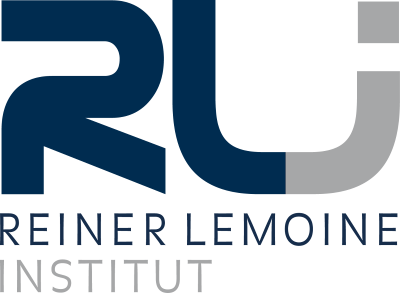
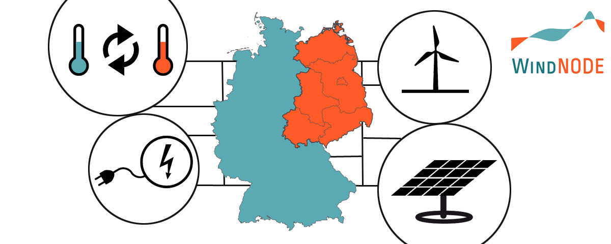

**Welcome to WindNODE ABW documentation!** It is one part of the Reiner Lemoine Institute's (RLI) engagement in the
research project WindNODE.

Project context
---------------

The joint research project `WindNODE <https://www.windnode.de>`_ aims at understanding the efficient interplay of
renewable energy generation and consumption as well as the energy grids in between. This takes place in northeastern
Germany as a model region. RLI is one of about 70 project partners who share work packages and tasks. WindNODE is one of
five joint research projects that are funded within the `SINTEG <https://www.sinteg.de>`_ Initiative (Showcase
Intelligent Energy – Digital Agenda for the Energy Transition) by the German Federal Ministry for Economic Affairs and
Energy (BMWi).

In the region of Anhalt-Bitterfeld-Wittenberg (ABW), we focus on the use of flexibility options in order to use excess
energy and to increase the share of renewable energy within the regional energy system. The investigations take place in
close cooperation with our partners `Energieavantgarde Anhalt (EAA) <https://www.energieavantgarde.de>`_,
`Fraunhofer IEE <https://www.iee.fraunhofer.de>`_, and the
`Institute for Ecological Economy Research (IÖW) <https://www.ioew.de>`_.

* Project duration: 01.12.2016 - 30.11.2020
* Grant no: 03SIN525

In addition to the investigations in the *Reallabor Anhalt* documented here, another case study was conducted in the
*Kraftwerk Uckermark*. Refer to our
`project website <https://reiner-lemoine-institut.de/en/windnode-schaufenster-fuer-intelligente-energie-nordostdeutschland/>`_
or to the `WindNODE KWUM <https://windnode-kwum.readthedocs.io>`_ model documentation for further information.

The region Anhalt-Bitterfeld-Wittenberg (ABW)
---------------------------------------------

The Anhalt-Bitterfeld-Wittenberg (ABW) region modelled in this tool is located in the east of Saxony-Anhalt comprising
the three districts Anhalt-Bitterfeld, Wittenberg, and the city of Dessau-Roßlau. It has a total area of 3,629 km² and a
population of 370,190 inhabitants in 2017.

.. figure:: images/map_de_abw.png
   :width: 40 %
   :align: center

   Region ABW in Germany

.. figure:: images/map_abw_muns.png
   :width: 75 %
   :align: center

   Region ABW with municipalities

Table of contents
-----------------

.. toctree::
   :maxdepth: 2

   scenarios
   energy_system_model
   land_eligibility
   data
   results
   usage_notes
   zbibliography
