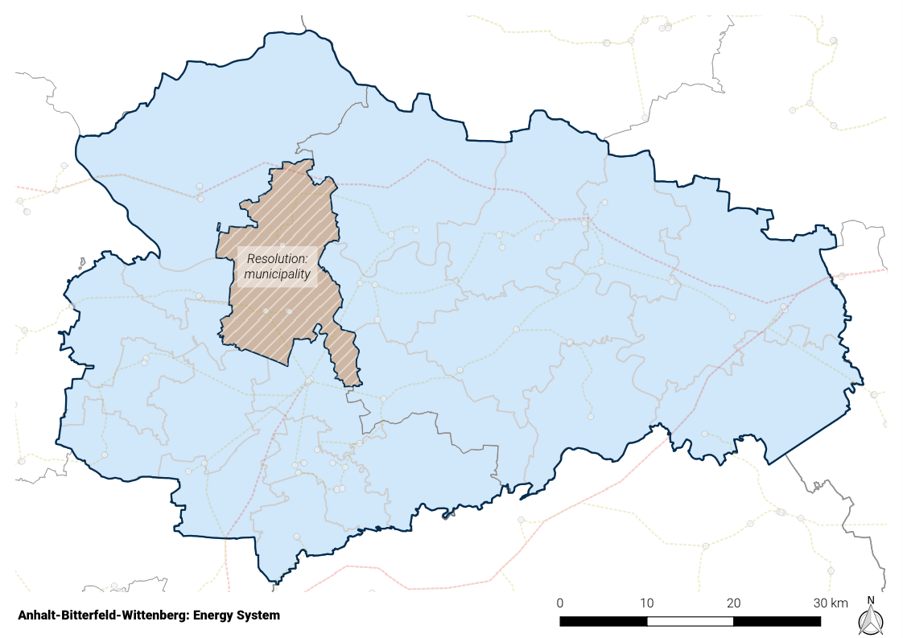

.. _land_availability_label:

Land eligibility for RE
=======================

The subject of this section is the analysis of land eligibility for wind energy and photovoltaics.

We identified several issues in workshops with local stakeholders, which we will address in this section. First, the
land use - especially for wind energy - became a key matter of debate in Germany and, to the same extend, in the ABW
region as the number of wind turbines have been growing dramatically during the last decades. On the one hand,
renewables are perceived as a key element of the energy transition. Superordinate targets set by the federal government
have to be implemented on a local level. On the other hand, regional concerns should be considered as the designation of
wind turbine sites by regional planning authorities and their realization crucially depend on the acceptance of the
people living in the surroundings of those sites. This matter of conflict motivates the question: "To what extent can
the region be supplied by renewables considering the available area?"

Wind energy
-----------

Wind energy makes the largest contribution to renewable power generation in the ABW region. In the end of 2017, 438
turbines with an installed capacity of 717 megawatts already covered around 45% of the regional electricity demand.
The further expansion and repowering of existing plants plays an important role in the transformation of the energy
system.

Wind turbines are privileged according to §35 BauGB :cite:`BWE2019`. However, it is necessary to consider important
concerns such as nature and resident protection as well as the control of wind energy planning by designating
so-called concentration areas in regional and land use plans with preclusive effects in the remaining planning area.
In the ABW region, it is the responsibility of the regional planning authority
(*Regionale Planungsgemeinschaft Anhalt-Bitterfed-Wittenberg*) to designate such priority areas (VR/EG, German:
Vorrang-/Eignungsgebiete), the *Teilplan Wind ABW 2018* can be found in :cite:`ABW2018a`. The planning area
includes the districts of Wittenberg, Anhalt-Bitterfeld and the independent city of Dessau-Roßlau :cite:`ABW2018b`.

In a nutshell, so-called "strict" and "weak" restriction areas are excluded from the planning area, which are not
available for wind energy use for various reasons (e.g. nature conservation, existing infrastructure, other interests,
etc.). This results in potentially eligible areas - the so-called "search area" - which account for around 10% of the
entire planning area. These areas are subject to a case-by-case examination (see below), which leads to an exclusion of
about 90% of the search area. As a result, approx. 1 % of the planning area is still available for the designation of
VR/EG; 3590 ha (0.98 %) were actually designated as VR/EG :cite:`ABW2018a`.

Restriction areas
^^^^^^^^^^^^^^^^^

The regulations in effect with regard to restrictive areas are taken from :cite:`ABW2018a`, :cite:`ABW2018a`.
The restriction areas include:

:"Strict" restrictions:

    * Settlements +500 m buffer
    * Existing infrastructure such as roads, railway tracks, airfields
    * Nature conservation areas (German: Naturschutzgebiete)
    * Protected landscape elements (German: Geschützte Landschaftsbestandteile)
    * Special protection areas (German: Vogelschutzgebiete)
    * Drinking water protection areas, zones I+II (German: Trinkwasserschutzgebiete der Zone I+II)

.. _map_abw_esys1:

:"Weak" restrictions:

    *

Repowering
^^^^^^^^^^

Assumptions and constraints
^^^^^^^^^^^^^^^^^^^^^^^^^^^

Results
^^^^^^

Ground-mounted photovoltaics
----------------------------

Potential areas
^^^^^^^^^^^^^^^

Restriction areas
^^^^^^^^^^^^^^^^^

Assumptions and constraints
^^^^^^^^^^^^^^^^^^^^^^^^^^^

Results
^^^^^^

Rooftop photovoltaics
---------------------

* The potential for rooftop PV is taken from the herkules :cite:`BKG2021`, :cite:`BKG2021a`

Results
-------

:numref:`re_power_potential` shows...

.. _re_power_potential:
.. figure:: images/RES_power_potential_vs_REx_scenarios.png
   :width: 100 %
   :align: center

   Installable capacity for wind and PV considering four land-use scenarios. Capacity is given in GW (wide bars,
   left axis) and relative to the installable capacity under consideration of the current legal status quo (narrow bars,
   right axis), which is applied to determine the capacity for *RE-* scenarios.
