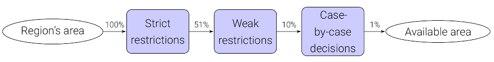
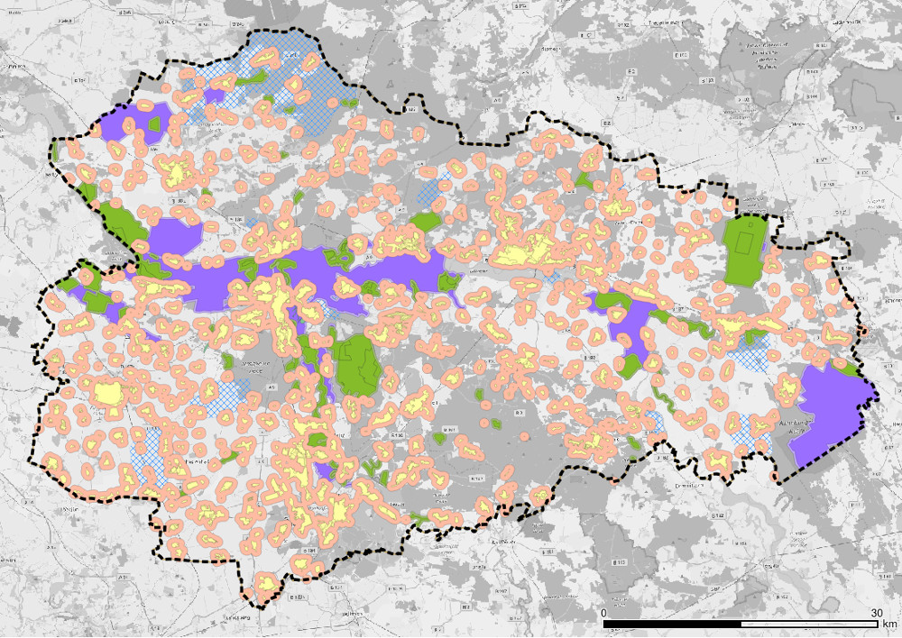
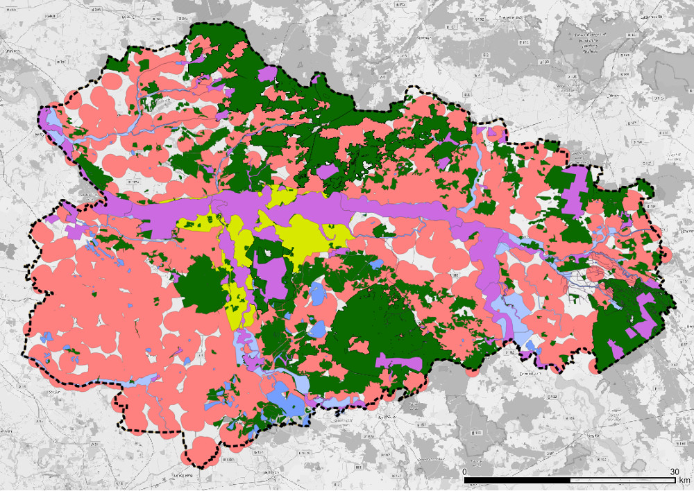
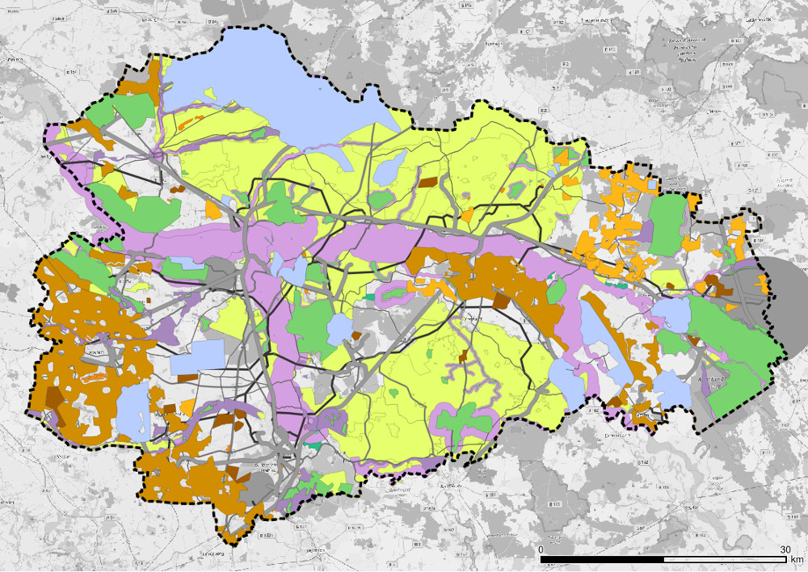
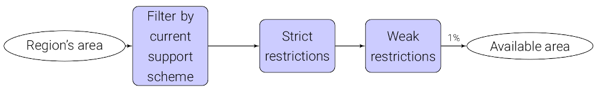
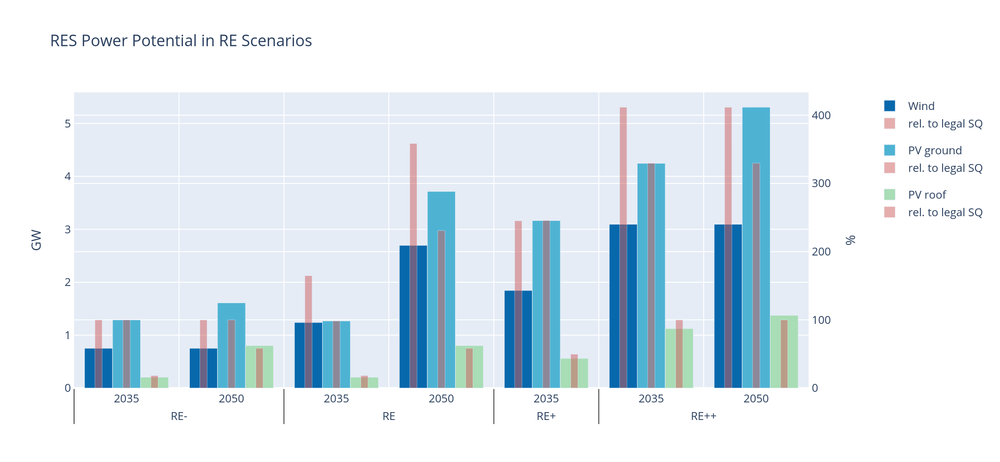

.. _land_availability_label:

Land eligibility for RE
=======================

The subject of this section is the analysis of land eligibility for wind energy and photovoltaics.

We identified several issues in workshops with local stakeholders, which we will address in this section. First, the
land use - especially for wind energy - became a key matter of debate in Germany and, to the same extend, in the ABW
region as the number of wind turbines have been growing dramatically during the last decades. On the one hand,
renewables are perceived as a key element of the energy transition. Superordinate targets set by the federal government
have to be implemented on a local level. On the other hand, regional concerns should be considered as the designation of
wind turbine sites by regional planning authorities and their realization crucially depend on the acceptance of the
people living in the surroundings of those sites. This matter of conflict motivates the question: "To what extent can
the region be supplied by renewables considering the available area?"

Wind energy
-----------

Wind energy makes the largest contribution to renewable power generation in the ABW region. In the end of 2017, 438
turbines with an installed capacity of 717 megawatts already covered around 45% of the regional electricity demand.
The further expansion and repowering of existing plants plays an important role in the transformation of the energy
system in the region :cite:`MULE2019`.

Wind turbines are privileged according to §35 BauGB. However, it is necessary to consider important concerns such as
nature and resident protection as well as the control of wind energy planning by designating so-called concentration
areas in regional and land use plans with preclusive effects in the remaining planning area :cite:`BWE2019`.
In the ABW region, it is the responsibility of the regional planning authority
(*Regionale Planungsgemeinschaft Anhalt-Bitterfed-Wittenberg*) to designate such priority areas (VR/EG, German:
Vorrang-/Eignungsgebiete), the *Teilplan Wind ABW 2018* can be found in :cite:`ABW2018a`. The planning area
includes the districts of Wittenberg, Anhalt-Bitterfeld and the independent city of Dessau-Roßlau :cite:`ABW2018b`.

In a nutshell, so-called "strict" and "weak" restriction areas are excluded from the planning area, which are not
available for wind energy use for various reasons (e.g. nature conservation, existing infrastructure, other interests,
etc.). This results in potentially eligible areas - the so-called "search area" - which account for around 10% of the
entire planning area. These areas are subject to a case-by-case examination, which leads to an exclusion of about 90% of
the search area. As a result, approx. 1 % of the planning area is still available for the designation of VR/EG as shown
in :numref:`re_wind_diagram`; 3590 ha (0.98 %) were actually designated as VR/EG :cite:`ABW2018a`.

.. _re_wind_diagram:

   Calculation of eligible areas for wind turbines

The individual steps are described in the following subsections.

Restriction areas
^^^^^^^^^^^^^^^^^

Regulations and assumptions on the restriction areas are taken from :cite:`ABW2018a`, :cite:`UBA2013`, :cite:`BMVI2015`
as well as the current legislation in force. The restriction areas include:

:"Strict" restrictions:

    * Settlements (+500 m buffer)
    * Existing infrastructure such as roads, railway tracks, airfields
    * Nature conservation areas
    * Protected landscape elements (German: Geschützte Landschaftsbestandteile)
    * Special protection areas
    * Drinking water protection areas: zones I+II

:"Weak" restrictions:

    * 1000 m buffer zone around settlements
    * Fauna flora habitats
    * Forest defined in § 2 WaldG LSA
    * UNESCO heritage sites (in ABW: *Gartenreich Dessau-Wörlitz*)
    * Floodplains
    * Standing water bodies >1 ha (+65 m buffer)
    * Rivers of 1st order (+65 m buffer)

:Case-by-case examination:

    * Buffer zones of 200...1000 m around fauna flora habitats depending on the presence of protected bats
      (Bechstein's bat and greater mouse-eared bat)
    * Landscape protection areas
    * Nature parks
    * Biosphere reserves
    * Reserved areas for the development of an ecological network system (German: Vorbehaltsgebiete für den Aufbau eines
      ökölogischen Verbundsystems)
    * Priority areas for nature and landscape (German: Vorranggebiete für Natur und Landschaft)
    * Natural monuments (German: Naturdenkmale inkl. Flächennaturdenkmale)
    * Drinking water protection areas: zone III and priority areas for water extraction
    * Priority and reserved areas for agriculture (German: Vorrang- und Vorbehaltsgebiete für die Landwirtschaft)
    * Priority and reserved areas for raw materials production (German: Vorrang- und Vorbehaltsgebiete für die
      Rohstoffgewinnung)
    * Municipal planning and planning intentions, natural scenery, private concerns
    * Existing infrastructure
        * Highways (+100 m buffer)
        * Federal roads (+80 m buffer)
        * State and municipal roads (+20 m buffer)
        * Railway tracks (+250 m buffer)
        * Railway properties
        * Airports and airfields (+1760 m buffer for civil use, +6 km buffer for military use)
        * High voltage overhead lines (+120 m buffer)
        * Ground-mounted PV plants

Further assumptions
^^^^^^^^^^^^^^^^^^^

For the allocation of wind turbines we make use of a greenfield approach based upon the calculated potential areas,
hence the age structure of existing turbines as well as repowering at existing sites are neglected. Instead, an average
land use of 20 hectares per turbine (:cite:`MLV2018`, :cite:`UBA2013`, :cite:`BMWi2017a`) is assumed.

An Enercon E-141 (4.2 MW) with a hub height of 159 m is used as model turbine in all future scenarios.

Results
^^^^^^^

Results are evaluated with regard to two central parameters, distance to settlements and the use of forest areas, which
are subject of the current political and public debate. The current legislation prescribes a distance to settlements of
1000 m in Saxony-Anhalt :cite:`LSA2015`, :cite:`FAwind2021`. Additionally, 500 m and 1500 m are used to evaluate how a
decreased or increased distance would affect the total available area. Results are shown in the following table, the
regulatory status quo (designated wind priority areas - *VR/EG*, cf. above) is given as reference.

+-------------------------------+---------------------+-------------+-----------------------+----------------+
| **Distance to**               | **Use**             | **Results**                                          |
| **settlements [m]**           | **forest areas?**   +-------------+-----------------------+----------------+
|                               |                     | Area [ha]   | Installable turbines  | Installable    |
|                               |                     |             | WEA (10% of area,     | nom. power [MW]|
|                               |                     |             | 20 ha/MW)             |                |
+-------------------------------+---------------------+-------------+-----------------------+----------------+
| 500                           | no                  | 87847       | 439                   | 1844           |
+-------------------------------+---------------------+-------------+-----------------------+----------------+
| 1000                          | no                  | 30713       | 154                   | 752            |
+-------------------------------+---------------------+-------------+-----------------------+----------------+
| 1500                          | no                  | 7461        | 37                    | 155            |
+-------------------------------+---------------------+-------------+-----------------------+----------------+
| 500                           | yes                 | 147652      | 738                   | 3100           |
+-------------------------------+---------------------+-------------+-----------------------+----------------+
| 1000                          | yes                 | 69057       | 345                   | 1449           |
+-------------------------------+---------------------+-------------+-----------------------+----------------+
| 1500                          | yes                 | 25629       | 128                   | 538            |
+-------------------------------+---------------------+-------------+-----------------------+----------------+
| **Reference:** Designated priority areas of status quo (*VR/EG*: 3590 ha)                 | **750**        |
+-------------------------------+---------------------+-------------+-----------------------+----------------+

An analysis of the results is given in the end of this section: :ref:`re_results_land_use`.

Ground-mounted photovoltaics
----------------------------

As shown in :numref:`re_pv_diagram`, ...

.. _re_pv_diagram:

   Calculation of eligible areas for ground-mounted PV

Potential areas
^^^^^^^^^^^^^^^

Restriction areas
^^^^^^^^^^^^^^^^^

Assumptions and constraints
^^^^^^^^^^^^^^^^^^^^^^^^^^^

Results
^^^^^^

An analysis of the results is given in the end of this section: :ref:`re_results_land_use`.

Rooftop photovoltaics
---------------------

* The potential for rooftop PV is taken from the herkules :cite:`BKG2021`, :cite:`BKG2021a`

.. _re_results_land_use:

Definition of land use scenarios
--------------------------------

Based upon the above potentials four different RE scenarios are defined: **RE-**, **RE**, **RE+** and **RE++** which
reflect different land use configurations and accordingly, different degrees of RE penetration. Each of the global
:ref:`_scenarios` is assigned one of these RE scenarios, a full list is given in :ref:`_scenario-details-re`.

The analysis of the available area for wind and PV installations already reveals important insights regarding stated
research questions. :numref:`re_power_potential` presents installable capacity of wind and PV for the four land use
scenarios (**Wind+** and **PV+** are integrated into **RE+**) and for each target year.

.. _re_power_potential:

   Installable capacity for wind and PV considering four land use scenarios. Capacity is given in GW (wide bars,
   left axis) and relative to the installable capacity under consideration of the current legal status quo (narrow bars,
   right axis), which is applied to determine the capacity for *RE-* scenarios.

On the left hand side, the scenario assuming the lowest capacity installations (**RE-** reflects the current regulatory
status quo. In this comparatively restrictive scenario, the available area for wind turbines and ground-mounted PV is
entirely used and serves as a reference for the relative land use in the other scenarios. For realizing wind turbine
capacity as assumed in **RE** (reflects capacity of *NEP 2035*), 165 % of the available area under current legislation
would be required. This could already be achieved by wind installations in 10 % of not restricted forestal areas.
In order to achieve installations according to *ISE 2050*, it would be necessary to reduce the minimum required distance
of wind turbines from settlements to 500 m. It further becomes clear, that in **RE**, there is sufficient space to
realize the required ground-mounted PV power of *NEP 2035* but not for the targets of *ISE 2050* where the available
area is exceeded by 130 %. For the more ambitious land use restriction scenarios **RE+** and **RE++**, the areas
necessary for wind and ground-mounted PV strongly exceed the designated areas in 2035 as well as in 2050. In all land
use scenarios, the capacity of roof-mounted PV is lower than or equal to the available potential. To sum up, it can be
said that even in the regulatory status quo, the region has space to increase the amount of renewables to a certain
extent, but to reach a deep decarbonization, the designation of further areas is essential.

.. note::

    A detailed description on how the feedin timeseries of fluctuating renewables are calculated and integrated into the
    energy system model can be found in :ref:`esm_fluctuating_renewables_label`.
