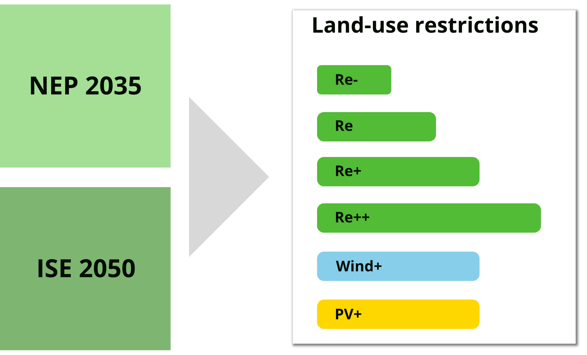
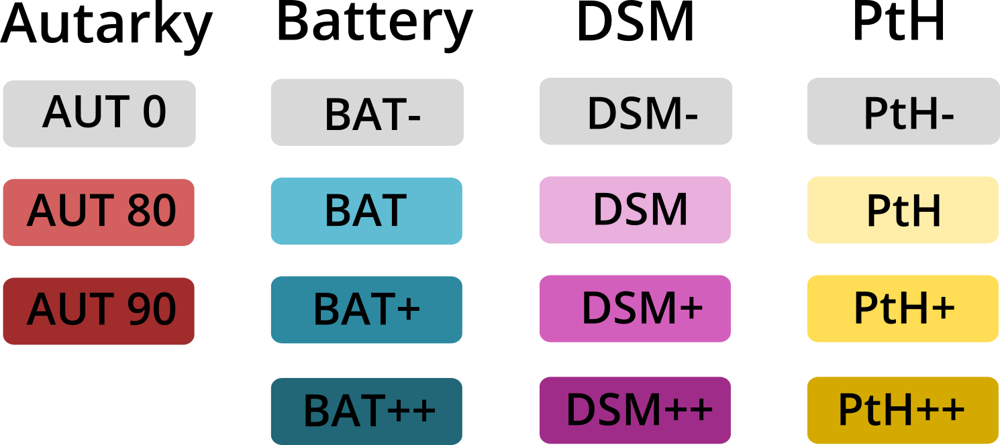

.. _scenarios:

Scenarios
=========

The scenarios are build along two main dimensions: generation capacity of RES and diffusion of flexibility options.
We look at the years 2035 and 2050. Aside from expected generation capacity the pillars also define the characteristics
of the demand side.

The generation capacity fundamentally derives from two studies. For the year 2035 we follow the assumptions by the
Netzentwicklungsplan 2035 (2021) :cite:`NEP2021`. For the climate neutral scenario, which might be in 2050, the
scenarios base on a study by Fraunhofer ISE :cite:`ISE2020`.
For reference and as basis for data preparation of future scenarios *NEP* and *ISE*, a scenario for the status quo
is defined. Demand and generation is expected to remain the same as in 2017 in this scenario.

The second main dimension that describe how much flexibility is deployed to the system, splits into four sub-dimensions.

Based on these dimensions, 39 computable scenarios are defined which are described in detail in :ref:`scenario-details`.

.. _research-questions:

Research questions
------------------

During workshops with stakeholders from the region Anhalt-Bitterfeld-Wittenberg (ABW), important topics related to
energy supply where identified. Thereof, the following three research questions resulted:

* To what extent can the region be supplied by renewables considering the available area?
* Which degree of autarkic energy supply is realizable in this region?
* How can new flexibility options support the integration of RES and enhance energy autarky?

Time horizon
------------

The model includes scenarios for the years 2035 and 2050. Data for describing the status quo is taken mostly from the
year 2017.
The network development plan :cite:`NEP2021` provides the basis for defining the scenario for the year 2035.
The study of :cite:`ISE2020` frames the assumptions made for climate neutral scenarios in 2050.

.. _scenario-details:

Scenarios data in detail
------------------------

Most important parameters that distinguish the individual scenarios are shown below.

.. include:: scenario_overview.rst

.. note::

   The scenario *ISE_RE-_AUT90_DSM_BAT_PTH* is not listed here, because it creates an infeasible optimization problem.
   This scenario replicates assumptions made in *ISE_RE-_AUT80_DSM_BAT_PTH* except for the limit on electricity supply
   from the national grid which is further reduced to 10 %.

How these scenarios are constructed and how parameters are determined is described for each scenario dimension in the
subsections below.

Renewable energy installations (RE)
^^^^^^^^^^^^^^^^^^^^^^^^^^^^^^^^^^^

Capacity of renewable energy sources (RES) is taken from studies investigating future energy supply of Germany.
Based on an in-depth analysis of available sites for RES installations, the capacity is further restricted.
See :ref:`land_availability_label` for a detailed analysis of the restriction areas.

For estimating the future RES capacity in the region Anhalt-Bitterfeld-Wittenberg (and in the individual
municipalities), a *prox-to-now* approach is used. This means, the national increase of RES generation capacity is
disaggregated to each municipality by the existing capacity. For example, a 80 % increase of PV generation capacity at
national level translates to an increase of PV capacity for each municipality by 80 % of the existing capacity.
Thereby, the maximum available land is respected and in case of not sufficient space in one municipality, exceeding
capacitiy is located in a neighboring municipality.

Details of the disaggregation of RES capacity for each of the options along the scenario dimension RES capacity are
explained in the following two tables.

NEP
"""

Capacity in the "NEP scenarios" is build upon :cite:`NEP2021`.

.. include:: re_scenarios_nep.rst

ISE
"""

Capacity in the "ISE scenarios" is build upon :cite:`ISE2020`.

.. include:: re_scenarios_ise.rst

Demand-side management (DSM)
^^^^^^^^^^^^^^^^^^^^^^^^^^^^

The number of households equipped with DSM infrastructure (devices and ICT) is varied.
The numbers used in each scenario variation are derived from :cite:`Styczynski2015`. They estimate the numbers of
households that are being equipped with DSM by technical feasibility (German: *Realisierbarkeitsfaktor*) and
user-side acceptance (German: Akzeptanzfaktor).
Values for the year 2035 (NEP) are estimated applying a linear interpolation.

NEP
"""

Parameters applied for "NEP scenarios".

.. include:: dsm_scenarios_nep.rst

ISE
"""

Parameters applied for "ISE scenarios".

.. include:: dsm_scenarios_ise.rst

Battery storage capacity
^^^^^^^^^^^^^^^^^^^^^^^^

The battery storage capacity is determined by scaling with installed RES capacity. The ratio between battery storage capacity
and RES generation capacity is taken from :cite:`NEP2021`. This is also applied to ISE-scenarios using the same ratio,
but RES generation capacity from :cite:`ISE2020`.
Spatial allocation of battery storage capacity follows the same idea down to municipality level.

.. include:: battery_storage_scenarios.rst

Power-to-heat
^^^^^^^^^^^^^

By 2035, for the NEP scenario, it is assumed that 15 % of the total heat demand is supplied by heat pumps.
For the climate neutral scenario in 2050 it is estimated that 70 % of the total heat demand is covered by heat supply
from heat pumps.
The inherent thermal storage capacity induced by pipes in decentral heating systems is assumed with 20 l/kW of
installed heat pump power according to suggestions by the manufacturer Viessmann :cite:`Viessmann2011`.
The additional heat storage capacity for buffering (which provides flexibility) is estimated with 60 l/kW of installed
heat pump power.
For the scenarios *PTH+* and *PTH++* an increased heating storage capacity for heating systems equipped with heat
pumps is assumed. Total heat storage capacity is given in brackets in the table below.

.. include:: pth_scenarios.rst

Autarky
^^^^^^^

With the scenario dimension autarkic supply, it is investigated how region's energy demand can be supplied under
constrained imports of electricity.
Autarky on annual balance of 80 % and 90 % is analyzed based in the in-depth investigation of regional autarky in RES
based electricity supply by :cite:`moeller2020`.

.. include:: autarky_scenarios.rst

.. note::

   Further modelling details and assumptions are described in :ref:`esm`.
